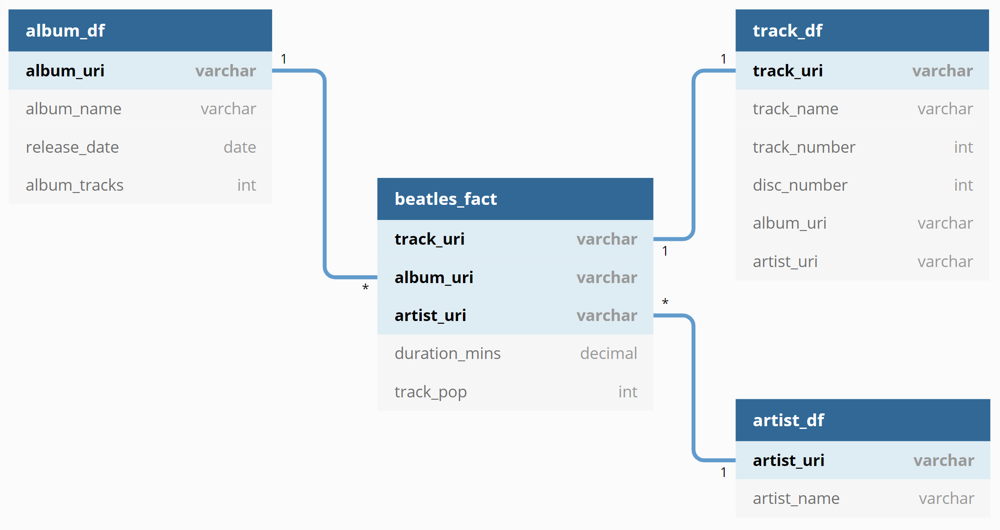

---
authors:
- admin
categories:
- Python
date: "2020-05-22T00:00:00Z"
draft: false
featured: false
image:
  caption: ""
  focal_point: ""
  placement: 2
  preview_only: true
lastmod: "2020-05-22T00:00:00Z"
projects: []
subtitle: ''
summary: I was able to connect to Spotify and pull all artist, album, and track information about The Beatles by using an API. This post features information on this project, and how the Spotify API was useful.
tags:
- Python
- PostGreSQL
- API
- Spotipy
- API
- Psycopg2
- SQL
- Schema
title: All You Need Is Love...For APIs
---
Spotify is one of the most popular music streaming apps in the entire world. In fact, according to [this Forbes article](https://www.forbes.com/sites/johnkoetsier/2020/12/30/top-100-apps-of-2019-netflix-uber-spotify-google-pay-wish-and-more/#4b70df94ca07), Spotify was the top music streaming app of 2019. Pretty impressive!

From films to weddings, music is an important aspect of everyone's life. We all have those songs, artists, and albums that resonate with people or times in our life, and they can hold a special place in our hearts. The Beatles are that kind of band to me. Not only are they one of the most notable bands of our lifetime, but their music shows and incredible amount of growth and intelligence in the span of a few years in the 60's.

One driver of this project was to have a resource to see the most popular songs that The Beatles have on Spotify. The other driver...was using Spotify's API.

## What's An API?

API stands for "Application Programming Interface", which sounds more complicated than it is. Essentially, an API is a technological way to retrieve data from somewhere and gives it back to you. Your computer connects to a data source through the information, pulls data, then brings it back to you!

Typically...the process of connecting to an API can get a little ugly, depending on where the connection is made and the data they're giving you. However, Python has a specific library for connecting to the Spotify API called Spotipy. Spotipy already has the code set up to be able to connect to Spotify, and therefore can be much easier to use. In terms of APIs, Spotify is what's know as an API wrapper - it wraps up the code to connect to Spotify's API like a gift to you!

Once all of the data was pulled from the Spotify API, I then designed the layout of the tables through a star schema.

## Star Schema?

A star schema is a way to organize tables in a database, in which there's a main table (called a "fact table") that has all measurements, and then there are supporting tables (called "dimensions") that have information about those facts. Facts and dimensions are connected together using some sort of key or id. If you'd like an idea of what this looks like visually, take a look at the picture below:

In the case of The Beatles, the fact table featured a numerical popularity score, and the length (in minutes) for each track. The three dimension tables held artist, album, and track information specifically. These tables were then connected using an ID used in Spotify called a URI. Spotify has album URIs, artist URIs, and track URIs, which ultimately made connecting these tables very efficient!

In the visual above, you can also see little ones or asterisks next to the tables being connected. This is signifying HOW the tables are connected. For example, "album_uri" is connected between the album_df and beatles_fact tables, but album_uri has a little 1 next to it on the album_df table, while album_uri has a little * next to it on the beatles_fact table. This is called a "one to many" connection - ONE album has MANY tracks, while a track has only one album. 

Clear as mud? 

## PostGreSQL

After creating this schema, this data was exported to PostGreSQL using a Python library called "Psycopg2". PostGreSQL is an open source database software that operates using SQL. PostGreSQL has many features that make it great to use, the big one being that it's very reliable. Plus, the logo is an elephant - how cute is that? :smile:

Ultimately, exporting this data was a pretty easy process using the Psycopg2 library. So easy...that I may use PostGreSQL as my go-to database from now on!

## Overall Thoughts

This was a pretty simple project, but I'm glad I did it! In the future, I'm planning to connect to API resources without using a wrapper like Spotify's Spotipy in Python. Since the process of connecting to an API can have more complications, I thought it would be a good idea to work on those skills directly through a future project. Stay tuned - that will be coming next!