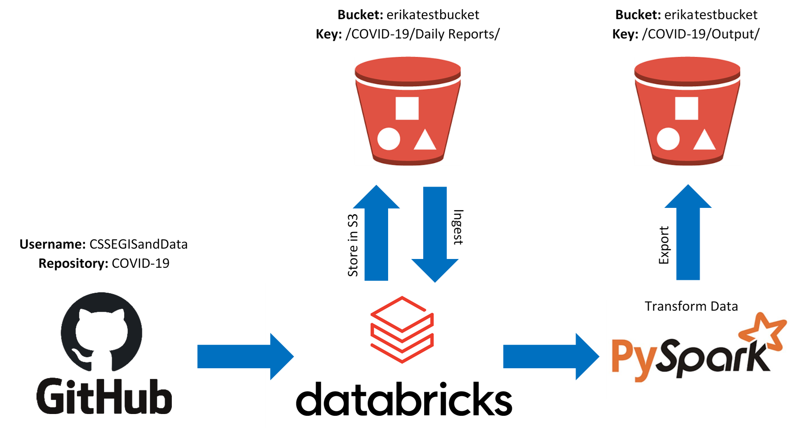

---
authors:
- admin
categories:
- Education
date: "2020-04-15T00:00:00Z"
draft: false
featured: false
image:
  caption: ""
  focal_point: ""
  placement: 2
  preview_only: true
lastmod: "2020-04-01T00:00:00Z"
projects: []
subtitle: ''
summary: Learning AWS through an interactive project took some work, yet the idea seems worth it for a variety of reasons!
tags:
- AWS
- S3
- EC2
- IAM
- Databricks
- PySpark
- Boto3
- S3FS
- GitHub
title: COVID-19 "Sparked" some AWS Ideas
---
Ahhh...the Coronavirus. The pesky virus that stopped daily life as we know it. The pesky virus that everyone's looking to understand a little better. The pesky virus that has many people looking at data visualizations like *never* before. 

Like many other data enthusiasts out there, I thought the Coronavirus seemed like a perfect topic to explore different skills I've been learning related to Data Engineering. So...here we are!

## Background Behind Project

As a data person during this COVID-19 crisis, I've been consistently checking any dashboard I can get my hands on for information about this illness and its spread. Johns Hopkins University has a [dashboard](https://coronavirus.jhu.edu/map.html) that features information daily about different locations and the number of cases they have.

As time has gone on, questions have been popping up about "when things can return to normal." A decision like this shouldn't be taken lightly, and should have data to back it up. Visualization can be a powerful tool to visually examine case growth, recovieries, deaths, and if new cases are declining.

The dashboard that Johns Hopkins provided has plenty of helpful information, and has some visualizations of its own worldwide. Despite this, it seemed like a good opportunity to provide everyone the ability to visually explore the data in ways that the Johns Hopkins dashboard (or any dashboard) might not permit. In other words, visualizing the data could be more accessible.

To prepare the data for this project, I wanted to purposely choose to exercise skills that I haven't used for a personal project before that would be useful as a future Data Engineer. For example, while I've used Amazon Web Services (AWS) for specific professional tasks, I've never used AWS for my own persona projects. I had also never done a project using PySpark as well, even though I already had some experience using it. As for DataBricks? DataBricks was *entirely* new territory.

The sections below will go over the technologies purposely used to complete this project, possible obstacles faced along the way, lessons learned, and other helpful hints that could be useful for anyone out there wanting to attempt something similar.

## Project Goal

The goal of this project was to use Python through DataBricks to import the Johns Hopkins University COVID-19 dataseets from Github, clean/manipulate the data for more useful insight, and store the resulting output in the cloud via AWS. Simple enough, right? 

Here is some modeling I completed to illustrate the process:

## About AWS

Amazon Web Services, or AWS, is a cloud computing platform as a service (PaaS), which offers a variety of products to be able to work with cloud technology. There are many benefits to using the cloud, which can include no upfront costs, free tier trials, pay-as-you-go structure, speed, reliability, and so much more!

Most of my AWS experience through this project was using S3, which is a storage system for files and objects in "buckets" through the cloud. However, I got to get familiar with EC2, IAM, and the AWS CLI through this project as well.

EC2 is essentially access to a virtual computer. IAM is responsible for making accounts, passwords, and access keys for permission to use different functionalities through AWS. The AWS CLI, or command line interface, would be a way to exercise those functionalities - for example, the CLI could be used to copy S3 objects from one bucket to another.

EC2 might be more heavily utilized for future projects, as having external computing power could be helpful depending on the project and task. Plus, EC2 would be great to pair with a project using Python - Jupyter Notebook can be accessed using an EC2 instance.

**Lesson Learned**: If you're considering experimenting and learning AWS, they have free tiers of services for newcomers to try (most being for 12 months). With that being said, **PLEASE do yourself a favor and explore the limits on AWS' free tiers.** Once you feel like you have? DO IT AGAIN!

The reason I say this is because I went over one of the free limits for using S3. I took time to explore the free tier limits, yet I must have missed this particular limit...which could have been avoided with a second review of those limits. Please don't make the unecessary mistake I did. Even if going above those free limits might be pennies of cost, be prepared and know your financial limits in AWS.

If you don't mind spending some money experimenting with AWS, AWS offers a service called cloud watch if you have a certain budget in mind you'd like alerts for. For example, I set an alert for spending over \$0.00, and got an alert when my spending went to \$0.01 (the horror). 

**Helpful Hint**: Through starting this project, I decided to pursue an AWS Solutions Architect certification, which will only help in learning different functionalities of AwS. **If you're looking to get very familiar with AWS, I'd highly suggest considering pursuing an AWS certification.** If you're learning the material anyway, you might as well have a marketable credential to recognize it :wink:

## About Boto3 and S3FS

With using AWS for this project, it was useful to use packages in Python specifically designed to bridge a connection to AWS S3. There were two packages in Python that I ended up getting familiar with through this project: Boto3 and S3FS

Boto3 is a software development kit (or SDK) which allows incorporation of command line processes within Python code. S3fs, on the other hand, stands for "s3 File System", and allows for code in Python to refer to S3 buckets and objects as if they were on your local computer.

Ultimately, I found Boto3 to be VERY useful, and would certainly use it again for future projects.

**Lesson Learned**: Be VERY careful with your AWS access keys! At the very start of working on this project, I had hard coded my AWS access keys that had full administrative access to my account into code I had uploaded to GitHub. This was BAD. Do NOT be me. As a result, I had to delete the entire project from GitHub, and had to delete the access keys.

Why is this bad? Well...Once someone has your access keys, they are essentially free to do as they please within the permissions those access keys grant. Usually, the things someone would use an AWS access key for aren't good things. Someone could use your buckets for storing large amounts of files on your dime - perhaps something illegal. Or someone could start multiple EC2 instances on YOUR account to mine bitcoin. You're essentially inviting hackers to take advantage of you!

If you plan to do a similar project, it's worth avoiding any potential hacking situations. Proactively, it's worth ensuring that the access keys for your AWS account have limited permissions in IAM, and to remove the access keys should they be leaked somehow. As I said earlier though...**Be VERY careful with your AWS access keys!**

## About DataBricks

Through this project, I learned how useful DataBricks can be! DataBricks is a data processing platform as a servicB (PaaS) created by the brilliant minds behind Apache Spark. Databricks is used to big data processing in the cloud, and was designed to be an alternative to Hadoop/MapReduce (also designed to process big data). DataBricks, in terms of efficiency, processes data very quickly and with more security. It's no wonder that big companies use it, which includes MY OWN (so I learned):

The one downside to using DataBricks, from my perspective, was using the free community edition. IN DataBricks, your code is attached a cluster - a group of computers that work to complete what you've programmed. In the free version, if your cluster goes unused for a period of time (two hours I think), the cluster terminates. This requires having to create a new cluster each time your code is run. This also means having to re-install every Python package that was being used for each new cluster.

I am SO thankful that there was a free community edition to use at all, but the biggest restriction in using it is having to re-attach a cluster everytime. However, paying for the service would be an entirely different experience - DataBricks would be a fantastic resource to have for big data projects.

**Lesson Learned**: Databricks was a very nice interface to use similar to Jupyter notebook, and it was easy to get started with using clusters to process data. With that being said, **be prepared for your cluster to terminate frequently if you're using the free community version of Databricks.** Using a paid version would allow clusters to be restarted and refreshed, but the free version requires creating a new cluster practically each time Databricks is used. This means having to re-install Python packages every time...

On the flip side, if you don't have PySpark installed, the time investment to re-create a cluster isn't very much compared to the money you're likely saving by using clusters through DataBricks community edition :smile:

## About PySpark

Apache Spark is well reknown software for processing large quantities of data. Instead of using Apache Spark directly, I used a package in Python called PySpark, which is automatically installed when using DataBricks.

I wanted to use PySpark because I hadn't used PySpark for a project before, and it can be very powerful for massively large quantities of data. What's great about PySpark is that it actually has SQL functions to allow processing of your data in a "lazy" way - due to size, Spark only completes changes to your table when asked!

**Lesson Learned**: PySpark can read a variety of file types. However, **Apache Spark CANNOT read files from a url easily.** It's one thing if the file is online in a storage location like S3 - that's okay, because that file is being held in memory somewhere. However, for this project, I learned that I could not read a file from GitHub directly using PySpark.

In order to import the file, it would need to be moved to some sort of local storage first.

**Helpful Hint**: It may be tempting to use PySpark for all projects considering how powerful it can be processing large amounts of data. One thing to keep in mind, however, is that **Pyspark is best for HUGE datasets** - it can actually be *slower* to use PySpark with small datasets.

## Takeaways From Project

All in all, I'm happy that I chose to do my project the way I did, as I learned so much through the process. With that being said, I can already see ways that this project could have been done better.

For one, it may not have been necessary to use PySpark for this project, as the data I was pulling in was not substantially large. While this project could have been done without PySpark, I'm glad that I had a real world project to apply my knowledge to, and this experience has better prepared me to work with larger quantities of data.

Given that PySpark may have been unnecessary, it might have been better to complete the project locally on my computer versus using DataBricks. DataBricks. DataBricks can be an extremely useful tool, yet is as useful as your need for clusters of computers to process your code.

With this part of my project complete, the next part of the project will be to create a dashboard for the data. With this many "sparked" ideas for learning, there are only more to come with the next part of this project :wink:

