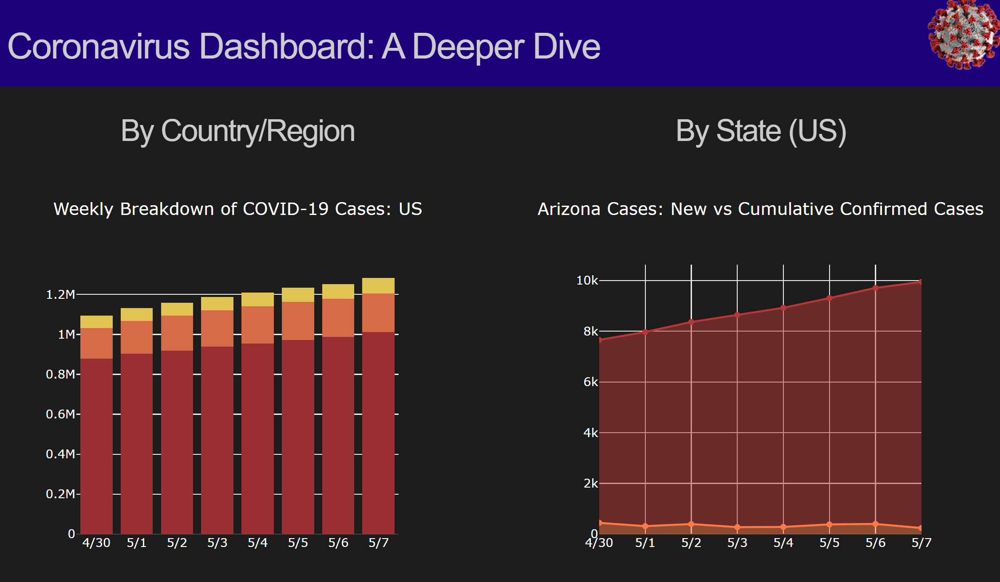

---
authors:
- admin
categories:
- Python
date: "2020-04-28T00:00:00Z"
draft: true
featured: false
image:
  caption: ""
  focal_point: ""
  placement: 2
  preview_only: true
lastmod: "2020-04-01T00:00:00Z"
projects: []
subtitle: ''
summary: After working with COVID-19 data from Johns Hopkins university through AWS, I thought it would be a good idea to make a dashboard to share information with others. This blog features the Dash library, which helps to build dashboards in Python!
tags:
- Python
- PySpark
- S3
- Dash
- HTML
- CSS
- Plotly
- Flask
- PyCharm
title: A Dash of Coronavirus Data
---
As I'm writing this post, COVID-19 is still rapidly spreading with cases exponentially increasing each day in the United States. It almost feels surreal at this point that - who knew that we would experience a worldwide pandemic like this in our lifetime?

With COVID-19 still being a relevant threat to public health, there's still a need and desire for visualizing the data available. In a [previous blog post](https://erikajacobs.netlify.app/post/covid-19-sparked-aws-ideas/), I mentioned that the Johns Hopkins Coronavirus data I had processed using PySpark would be placed into my own dashboard. Well...the dashboard is now finished - take a look at this beauty!

This dashboard was created using a library called "Dash" in Python. What is dash, you ask? Well - keep reading, and I'll tell you all about it! :smile:

## About Dash

Dash is a  Python library that is composed of framework to put together a web application or dashboard. Dash can be open source, but can also be used within an enterprise as well.

## Why Dash?

I was initially planning to create a quick Tableau dashboard to visualize this COVID-19 data, since I had read online that Tableau could be used alongside S3 (Where the data is stored). However, it costs money to use Tableau...and while there was a free trial I could have used as an educator, I wanted to learn a method of creating dashboards I could do repeatedly and affordably.

After doing a quick Google search on how to create dashboards using Python, I learned about Dash...and I was automatically on board!

## Starting With Dash

Six part video series: https://www.youtube.com/watch?v=Ldp3RmUxtOQ&t=2s

My data was already clean and ready to go using PySpark

## An IDE For Dash

Dash requires the right kind of IDE

Pycharm yada 

## Dash Documentation

2. Dash has some documentation, but not much

## Dash and Dashboard Style
3. Style sheets are your friend

css

## Dash Syntax = MySpace
4. Dash literally operates like html, but with Python syntax

Definitely had a little flash back to the days of Myspace, and the very little html experience I had as a teenager in the mid-2000's.A433

html

## Visualizations and Plotly

5. Visualizations Plotly

Plotly

## Hosting the Site

Heroku and AWS Elastic Beanstalk could be used, but Python Anywhere seemed to be the quickest to deploy.

Flask

https://www.youtube.com/watch?v=yRw95qVYKK8

deploy
Will want to learn Heroku in the future