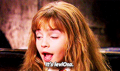
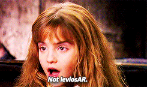
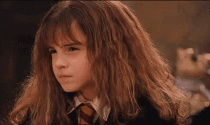

---
authors:
- admin
categories:
- Python
date: "2019-07-14T00:00:00Z"
draft: false
featured: false
image:
  caption: ""
  focal_point: ""
  placement: 2
  preview_only: true
lastmod: "2019-07-14T00:00:00Z"
projects: []
subtitle: ''
summary: Using Python, I cleaned all text data from the Harry Potter series to create a word cloud based on the cumulative word count. The end result was an artistic word cloud in a magical style fit for the Harry Potter universe.
tags:
- Image Editing
- Jupyter
- Keyword Analysis
- NLTK
- Pandas
- Pillow
- Python
- WordCloud
- Text Analysis
- Text Mining
title: 'Harry Potter and the Learning of WordCloud'
---
This is the second part of my Harry Potter text analysis project! If you haven't read part one, [Click Here]() to catch up. I used Python via Jupyter to make a word cloud of the most popular words in the Harry Potter series. Here is the word cloud I created:


This is the only output I have this week.and yet SO much learning was put into making it. This blog will explore basic keyword analysis from the books, as well as how I was able to use the WordCloud package (among other things) in Python. Also, if you'd like to look at my work on this project, [Click Here](https://github.com/ErikaJacobs/Harry-Potter-Text-Mining) to see the project files in my GitHub repository.

## Basic Keyword Analysis
Before diving into the process of creating the word cloud, let's dive into some findings related to keyword analysis.

### Which 10 non-stopwords appeared the most in this text?
1. Harry
2. Said
3. Ron
4. Hermione
5. Back
6. Dumbledore
7. Could
8. One
9. Like
10. Looked

It's a given that "Harry" would be the most frequently used word in this text. Out of the top 10 words, I'm surprised that four of them are characters. Given that there are many functional words outside of stopwords used in text (such as "said"), it's surprising that Ron, Hermione, and Dumbledore are mentioned more heavily than many functional words in the English language. At they same time, all three of those characters are important.so if characters other than Harry were to make it to the top 10 words, it would make sense that it would be them.

### Which characters were discussed the most in this text?
1. Harry
2. Ron
3. Hermione
4. Dumbledore
5. Hagrid
6. Snape
7. Malfoy
8. Sirius
9. Voldemort
10. Fred (Sorry George!)

In this list, it's important to note that "Malfoy" could be a reference to the entire Malfoy family (Lucius, Narcissa, Draco), versus Harry Potter's nemesis Draco Malfoy specifically. However, it's safe to say that Draco Malfoy would be in the top 10 character mentions based on how frequently he interacts with Harry throughout the series.

### Which spell-related words were mentioned most in this text?
1. Expecto
2. Patronum
3. Accio
4. Stupefy
5. Avada
6. Expelliarmus
7. Riddikulus
8. Kedavra
9. Lumos
10. Muffliato

"Expecto Patronum" appears to be the most frequently used spell in the series, which is a spell used to fight off dementors. I'll be honest though.This list surprised me in that Wingardium Leviosa wasn't on it!



Wingardium Leviosa is a spell for lifting items in the air, and is one of the most popular spell references from the films. However, it appears that it's not mentioned as much in the books - It wasn't anywhere near the top 10 spell-related words.



###Next Steps in Keyword Analysis
Next steps in conducting keyword analysis would be to follow trends of keywords throughout chapters, as well as within books. This could also be useful in sentiment analysis. This text analysis project will continue next week!

In the meantime, let's talk about the word cloud you saw earlier.

## Creating the Word Cloud

Creating the word cloud itself was a simple process. Like last week, the learning curve of working with this package AND in Python posed some obstacles. First step was installing the package itself, which (it seems) many people on the internet have also had trouble with. I use Python with Anaconda to manage the installation of Python packages. This is the code that I put into the Anaconda Prompt to install the WordCloud package:

```python
conda install -c conda-forge wordcloud
```

Once it was installed, there were a lot of questions that arose as I made my image:
- How do I get the text words out of a pandas dataframe?
- How do I get the word cloud to actually generate?
- How do you change the color of the background?
- How do you change the font of the words in the word cloud?
- How do you change the color of the font?
- Since changing font color needs a color map, how can one be created?
- How do I get my word cloud to take a particular shape?
- Okay.Why isn't my word cloud taking the shape it's supposed to?
- This word cloud looks lack luster. What if I want a background other than a solid color?

So.how were all of these questions answered?



I thought it might be helpful to break apart each segment of my Python code to explain the answers to these questions.

### Code Segment One:
```python
# Import packages/libraries
from wordcloud import WordCloud, ImageColorGenerator
from PIL import Image
 
# Delete "photo" object (to debug mask)
del(photo)
 
# Bring in mask data
photo = Image.open("Thunderbolt - Copy.jpg")
mask = np.array(photo)
 
plt.imshow(photo)
```

The above code installs the packages that were used for this word cloud project, and then prepares a mask for the word cloud. Answering a question on that list above.

#### *How do I get my word cloud to take a particular shape?*
With a mask. What's a mask, you ask?

A mask is a strictly black and white image that is used to make a word cloud into a particular shape. For my word cloud, I had wanted to make it into the shape of a lightning bolt, since that's the shape of Harry Potter's scar. I found resources online explaining how to do it, but those processes weren't working for me.

#### *Okay.Why isn't my word cloud taking the shape it's supposed to?*
I ran into difficulty getting my word cloud into the shape of the lightning bolt because the picture I was initially using wasn't perfectly black and white. Shading and grey scale will NOT do, ladies and gents. The parts of the picture you want words needs to be the blackest black, and the parts you don't want words needs to be the whitest white in order for this mask to work with the WordCloud package.

[This Stack thread](https://stackoverflow.com/questions/18777873/convert-rgb-to-black-or-white) helped me change a picture to strictly black and white, and then I saved it to a .jpg file. Using this black-and-white image didn't work as a mask unless the picture was brought into Python from a saved file. This might be due to formatting and how the picture is stored as a file versus in Python after alteration. If you're trying to make a word cloud and are having trouble with the mask, this might help in debugging.

### Code Segment Two:
```python
# Create Dictionary and list
wordcount={}
list = []
 
# Get Words Ready
for x in df.WordCloudText:
    list.extend(x)
     
# Clean text
textcount=str(list).split()
textcount=[''.join(c for c in s if c not in string.punctuation) for s in textcount] #Remove punctuation
 
# Wordcount Loop
# If the word is not in the stop words: 
#    it's added to the dictionary with a count.
# If the word already exists in the dictionary: 
#    the count is made one higher.
 
for word in textcount:
        if word not in wordcount:
            wordcount[word] = 1
        else:
            wordcount[word] += 1
 
# Clean messy words out of dictionary - FOR HP ONLY
del wordcount['¨c']
del wordcount['-']
del wordcount['ter']
     
# Printing 250 Most Common words in "Harry Potter"
Counts = collections.Counter(wordcount)
 
for word, count in Counts.most_common(250):
    print(word, ": ", count)
```

This segment of code answers one question.

#### *How do I get the text words out of a pandas dataframe?*
In my pandas dataframe, the column "WordCloudText" featured a list object of words in every row. I created a loop to place each row's list into one joint list called "list" (original name, I know). Then, the words were split up and punctuation was removed.

Once the text data was clean, a dictionary object was created in Python, in which each word went through a loop that would count the number of times the word appeared in total. Finally, before using this dictionary to create a word cloud, messy words were removed from the dictionary - i.e. ones that didn't make sense to include in the word cloud.

### Code Segment Three:
```python
# Create Color Maps
# Converted HTML/HEX colors to RGB using: https://htmlcolorcodes.com/
colorsList = ['#503F3F', '#801919'] #Mauraders Map Colors
ColorMap = matplotlib.colors.ListedColormap(colorsList)
 
# Create and generate a word cloud image:
wordcloud = WordCloud(mask=mask, margin=10, font_path='LUMOS.ttf', min_font_size=12, max_words=500, 
                      random_state=1, colormap=ColorMap, background_color=None, mode='RGBA').generate_from_frequencies(wordcount)
 
# Display the generated image:
plt.figure(figsize=[20,20])
plt.imshow(wordcloud, interpolation='bilinear')
plt.axis("off")
plt.show()
 
# Save image to file
wordcloud.to_file("HP_WordCloud.png")
```

This is the code for the meat of the word cloud itself, and there's a lot of questions to answer here!

#### *How do I get the word cloud to actually generate?*
At the end of the WordCloud function, "generate_from_frequencies(wordcount)" created the word cloud based on the word frequencies in the dictionary created.

#### *How do you change the color of the background?*
This one's easy! The WordCloud() function has an argument called "background_color". Before making my final creation, I used [this website](https://htmlcolorcodes.com/) to get the hex color I wanted. For example, a black background would have the argument "background_color='#000000'"

#### *How do you change the font of the words in the word cloud?*
The WordCloud() function has an argument called "font_path". This argument has to be set equal to the path to a .tff file for the font you'd like to use. I used the [Lumos](https://www.dafont.com/lumos.font) font for this project, and found it easiest to put the .tff file in my project's directory.

#### *How do you change the color of the font?*
The answer to this was surprisingly complex! It turns out that there's not an easy way to change the color of a font using the WordCloud() function. In order to do it, an argument called "colormap" had to be used.with a color map of your creation.

#### *Since changing font color needs a color map, how can one be created?*
Matplotlib has some color maps pre-made, which can be accessed [here](https://matplotlib.org/3.1.0/tutorials/colors/colormaps.html). Let's be honest though.if you're feeling creative and have an idea, don't you want to have more control over the colors you're using?

Like the background color, collecting hex colors for the font and putting them into a list was needed to create a color map. Then, the function matplotlib.colors.ListedColormap() would need to use your list to create the color map, and would need to be named something. For example, I called it "ColorMap".

Then, set the colormap argument in the WordCloud() function equal to the color map you created. In my code, I have "colormap=ColorMap"

#### *This word cloud looks lack luster. What if I want a background other than a solid color?*
The answer to this question opened an entire can of worms, and made my final creation cooler than I ever imagined. It required creating an image composed of different images. For the WordCloud function, the argument "mode='RGBA'" was placed so this could be achieved - The next section will talk about why this matters.


### Creating the Final Image

In order to make the final image you saw at the beginning of this blog, I made a composite image of RGBA picture files by using the Pillow package in Python. An RGBA picture file is a picture that has transparent parts to it. By making this word cloud an RGBA picture, I was able to paste it onto an image of parchment paper, and then add RGBA pictures of footsteps and Maurader's Map logos to make the final image.

I'll be honest.using Python to create this image wasn't the most efficient, mainly because using a photo editor to drag and drop some of these RGBA pictures would have been much quicker. In Python, you have to specify the coordinates that you'd like to paste pictures, which can take some trial and error to get perfectly. However, if you're like me and want to learn how to do it in Python, it's definitely a fun and creative way to do it :smile:

### Conclusions

The word cloud package in Python is pretty versatile! Making a word cloud into an RGBA image is a complete game changer for experimenting with cool backgrounds for the word cloud. Also, using a mask to shape the word cloud makes the entire experience more visually interesting.

Looking forward to continuing this project next week! Coming up next will be further keyword and sentiment analysis. Thanks for reading!

### Sources

I wouldn't have been successful with my word cloud this week if it weren't for the following sources:

- [This overview](https://amueller.github.io/word_cloud/generated/wordcloud.WordCloud.html) of the Word Cloud package
- [This blog](https://mubaris.com/posts/dataviz-wordcloud/) by Mubaris NK
- [This tutorial](https://www.datacamp.com/community/tutorials/wordcloud-python) from the Data Camp community
- [This guideline](https://matplotlib.org/api/colors_api.html) on colors in Matplotlib
- [This gallery](https://python-graph-gallery.com/262-worcloud-with-specific-shape/) of Python word clouds
- [This thread](https://stackoverflow.com/questions/42028462/wordcloud-with-a-specific-shape) on Stack
- [This thread](https://stackoverflow.com/questions/5324647/how-to-merge-a-transparent-png-image-with-another-image-using-pil) on Stack
- [This blog](https://minimaxir.com/2016/05/wordclouds/) by Max Woolf
- [This guide](https://pythontic.com/image-processing/pillow/rotate) on image processing
- [This guide](https://nerdparadise.com/programming/pythonpil) on image processing colors
- [This guide](https://pythontic.com/image-processing/pillow/crop) on cropping pictures in Python
- [This picture](https://nsm09.casimages.com/img/2019/04/05//19040503454211071516188495.png) of the Maurader's Map logo
- [This picture](https://cdn130.picsart.com/238867759123212.png?r1024x1024) of the Maurader's Map logo