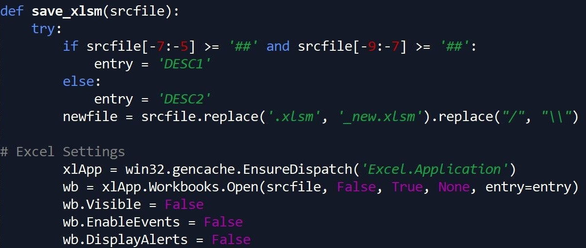

---
authors:
- admin
categories:
- Python
date: "2020-01-03T00:00:00Z"
draft: true
featured: false
image:
  caption: ""
  focal_point: ""
  placement: 2
  preview_only: true
lastmod: "2020-01-03T00:00:00Z"
projects: []
subtitle: ''
summary: This post discusses the preliminary stages of a Python project that extracts data out of hundreds of Excel files, followed by sending them to SQL Server. Jupyter posed some unexpected network issues, and Spyder was a wonderful solution!
tags:
- Python
- Excel
- VBA
- Macros
- Pandas
- Glob
- win32com
- ETL
title: 'How the Itsy Bitsy "Spyder" Saved My Project'
---
A couple months ago, I stumbled across a confidential "real life opportunity" to exercise my skills in working with data. While I can't explain specifics about the data I was working with or who this project was for, I was very excited to help with this project because the resulting data product would be extremely helpful to many people I care about :blush: 

Below I've outlined some information about the project, as well as the progress I've made so far.

## About This Project

The formation of this project came from a legitimate need in efficiency. This project was created due to an entity reporting numbers from hundreds of Excel files, which required going into each individual Excel file needed to obtain the information needed. Because these Excel files were large, opening each file would take more time than it should, slowing down the process of reporting these numbers.

Furthermore, the numbers came from a calculated dashboard in the file (rather than a table of data), which meant numbers from these files were being COPIED AND PASTED into reports. Not only was this process inefficient for reporting, but there was also large room for error due to copying and pasting these numbers.

That's where I came in!

The plan was for a Python script to go into multiple Excel files that had a similarly formatted data table, extracting this data out of each file, and importing this data into a Pandas dataframe. Then, once all Excel files were imported to Python, the resulting dataframe would be sent to a SQL Server table for use.

The plan seemed simple - yet real life isn't so simple! After copies of the files were made and put in a directory to be extracted, I ran into four primary issues before I was able to successfully import all Excel files with ease...

## Obstacle One: Corrupted Macros

Once upon a time, a mystery person created the file template I was working with. In this file template, they wrote a large amount of macros to operate certain calculations within the file template automatically. At some point, one or more of these macros became corrupted. 

One of the first things I did in this project was to try and import just one of these files to Python...and it didn't work! I had imported Excel files to Python before using the same process - so why wasn't this working? I tried copying the data into a blank file, and import worked. I tried deleting tabs in the original file template, and that did NOT work. At some point after researching and trying different solutions, I finally figured out that the macros in this file were the issue - primarily the corrupted one that mystery person wrote years ago.

So...I tried deleting all of the macros in Excel, and the import WORKED! Lesson Learned: **Pandas will NOT import an Excel file to Python if a macro is corrupted and causing trouble**. Equipped with this knowledge, I then realized this also meant deleting macros from ALL files for this project would need to happen (gross :confounded:). As a result, I ended up building a loop to remove all macros from these files.

Removing these macros through a loop required using VBA in Python using the win32com package, and saving a new copy of these files to leave the original file unaffected. Doing this loop also gave me the opportunity to save all files with macros removed with the same extension in Excel - prior to this step, many files had the .xls extension due to their age.

After this was finished, I was able to get these files into Python without issue. Finally...success!

## Obstacle Two: Changing Data Types and Columns

Once all of the Excel data was brought into Python, I realized there were two issues that required cleaning the data before exporting it to SQL. The final product should have 156 columns, yet there were a few more than that. It turns out that while these data files were similar over time, not all of them were the exact same. Some had columns that were slightly renamed, and others were missing columns as a whole. Therefore, it required some data cleansing to make sure the dataframe being exported had exactly 156 columns.

Another issue I ran into was the numerical fields being read as text fields. This would result in numbers being imported and rounded off, which resulted in numbers being slightly off. I had to change the structure of the import to allow for all numerical fields to be read as numbers. Luckily, this was a quick fix.

## Obstacle Three: Time and Memory

Due to the classified nature of this project, this project was required to be completed on a computer that wasn't my own. By doing this, there were unfortunately limitations in the type of software I could use, as well as the packages within Python due to the network being used and the hardware in the computer. This ultimately prevented me from being able to use programs such as PySpark that would have helped in creating this ETL process using large amounts of data. 

So...progress on this project took TIME. On top of that, it took every ounce of memory the computer had in order to do the task. It also took a steady network connection in order to stay connected to the source files through this computer. It was this network connection that ultimately posed the greatest issue in this project, which leads into the final obstacle I experienced...

## Obstacle Four: Jupyter Notebook

Jupyter Notebook is a browser-based environment for writing code in Python. I LOVE Jupyter! With that being said, network issues lead to Jupyter timing out and needing to constantly reconnect, with executed code not completing as a result.

While memory could have been an issue too, ultimately Jupyter notebook could not be used for this project due to the network connectivity issues I had. Unfortunately, a browser-based environment can be faulty if your internet connection is too.

So...I had to find another way to process the code I was running. What would be best to use? Ultimately I chose the most convenient option, Spyder, which ended up being a **great** fit for this project.

## About Spyder

Spyder is an open source integrated development environment (IDE) for Python. Since Jupyter wasn't working for my project, the reason why I ultimately tried Spyder was because it was automatically installed on my computer. I'm SO glad it was, because Spyder ended up having some important assets for this project...the biggest one being that a steady network connection was NOT needed in order to run the majority of my code.

The Spyder console reminds me of using R Studio in some ways. There's a variable explorer where you can look at the data items you've created with your code (dataframes, variables, lists, etc.), as well as a console to look at executed code and its results. 

One REALLY cool thing about Spyder is that it can catch simple errors ahead of time. For example, if you try to call a variable called "X" and you accidentally type "Xx", Python will let you know that variable "Xx" doesn't exist before running the code. This functionality has been especially helpful with this project, since there are so many components in the code I wrote. Like Jupyter, code can be "chunked" together in sections so all code does not need to be run at the same time. HOWEVER, Spyder has the capacity to also run all code at once. 

One weak point of using Spyder is the data visualization features. After running code for data visualization using a Jupyter notebook, the result usually shows a sizeable copy of the visualization. Spyder shows visualizations as well, yet it's limited to the console - meaning it's TINY. Data visualization wasn't relevant for this project, so that didn't matter to me as much...yet this could matter for other projects.

While I was disappointed that Jupyter didn't work for this project, I'm VERY glad that I tried using Spyder. There are some functionalities using Spyder that I actually like BETTER than using Jupyter depending on the project. I'm officially a huge fan of Spyder!

## Project Progress So Far

As of January 3rd 2020, I have been able to successfully get all Excel data imported to Python through a loop. I've done some basic data cleaning, removed unnecessary columns, and adjusted variable types in preparation for sending the data to SQL Server.

## What's Next?

At this point in time, all research has been done to get this data to SQL server - the code just hasn't been written yet. Hopefully this will be done very soon! 

After all data is placed in SQL Server, I would also like to make a second set of code for importing and replacing only one Excel file's data in SQL Server. This would allow for a repeatable process that can be used in the future to add to this table, versus having to upload all files every time there's an additional Excel file.

Once the data is in SQL Server, there will also need to be meetings on how to cleanse the data - since many of these files are older, some business decisions need to be made on how to handle certain aspects of the older data.

In the meantime, I will continue to add progress of my work onto GitHub! You can [Click Here](https://github.com/ErikaJacobs/Excel-Python-SQL-Migration) to access all files related to this project for your viewing pleasure. Thank you for reading!