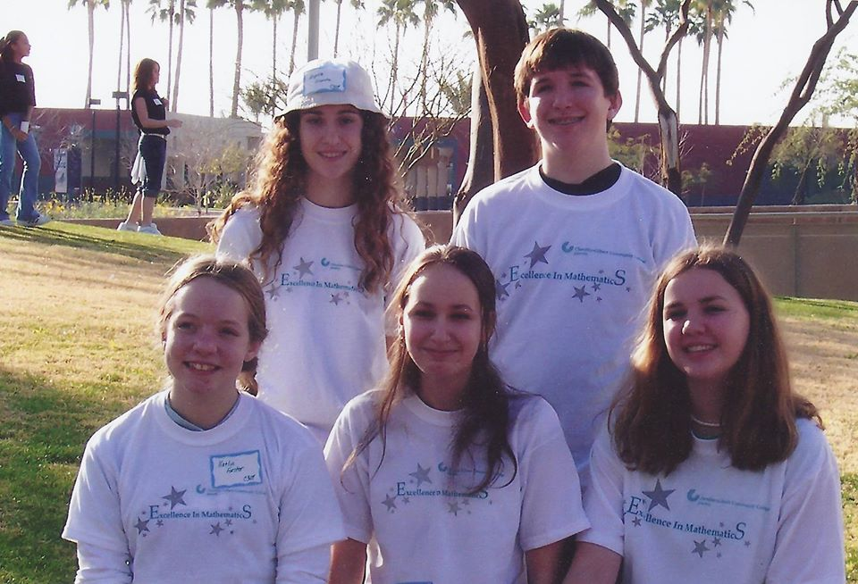
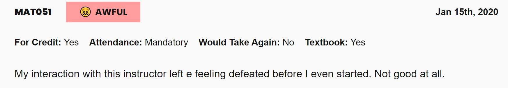

---
authors:
- admin
categories:
- Education
date: "2020-04-01T00:00:00Z"
draft: false
featured: false
image:
  caption: ""
  focal_point: ""
  placement: 2
  preview_only: true
lastmod: "2020-04-01T00:00:00Z"
projects: []
subtitle: ''
summary: With my first year of teaching at the college level coming to a close, what did I learn? What lessons can I carry with me for the rest of my professional career?
tags:
- Academic
- College
- Education
- Professional
title: 'Learning From Teaching: Year One'
---
If you're looking at the posts on my website or activity on GitHub, you might notice some very long gaps of activity between August 2019 and now (April 2020). Most of that is due to a personal passion of mine - I started my first year teaching at the college level, and recently finished it!

I taught two courses at Chandler-Gilbert Community College this year. Fall 2019 I taught MAT 142 (College Mathematics), and taught MAT 051 in Spring 2020 (Number Sense). Teaching both courses offered very different experiences, and I learned very different things from both courses as a result. Through those experiences, I feel better equipped to move forward into teaching future courses! 

## Teaching Going Forward

Currently, I am not slated to teach at Chandler-Gilbert during the summer or fall semesters of 2020. While I enjoy teaching, teaching on top of a full time job can be *very* difficult - especially when it's a class that you've never taught before. I feel like my teaching days are just beginning, yet I do need a break to focus on other aspects of my life. I will definitely revisit the idea of teaching in Spring 2021 and go from there :smile:

One of the things I'm looking to focus on during this break is my website and data-related projects. Expect to see more content coming soon! One thing I'd love to do eventually is start a "Data for Dummies" Youtube series and show people how to do a variety of data-related tasks. I feel like there's a huge market for teachers with good communication skills in the field, especially with more complex processes. Through learning on my own, I've found that most data science-related tutorials and guides assume a ton of technical knowledge that newcomers might not have. I'd love to help bridge that gap eventually!

I also wanted to spend more time with friends and family, but it doesn't seem like that will be happening given the current COVID-19 state of things. Luckily, social distancing gives plenty of time for new content :wink:

# A Reflection on Year One

Ultimately, I am SO grateful to have had the opportunity to teach at Chandler-Gilbert Community College this past year. I have learned SO much, and hope my students have learned plenty as well! I wanted to take a moment to reflect about this year, as well as the things I've learned through this experience.

Before getting into my reflections, there was one cool experience I had this year that doesn't really fit anywhere else - So I'm putting it here :smile:

I volunteered to help with CGCC's Excellence in Mathematics competition at the beginning of February, in which different middle schools came together to compete in mathematics both individually and as a group. Fun fact: I actually ATTENDED this competition when I was in 8th grade!

As an 8th grader, I went to this competition because my friends were all going, and I wanted to go with them. I liked math enough - If my friends were going, why not join them? 

WELL. Here we are years later, and I'm working that SAME math competition. The teacher that brought us years ago? She's there with her students too! It was a really cool moment to be able to reunite for both of us, and will be an experience I'll never forget.

This moment made me see how far I've come, and how much I've grown since that first competition, nevertheless through the last year of teaching. I'm very excited to share my reflections. Feel free to read as much (or as little) of my reflections below as you'd like!

## Teaching Online and Teaching In Person

I taught in person over the fall, and online over spring. Both ways of teaching are VERY different from each other, and have different positives and negatives. I might be biased based on the class I taught online, but teaching online seems to be MORE work than teaching in person, even considering that it doesn't require commuting or lecturing. 

Teaching online comes with more difficulty setting boundaries between a personal and professional life. You have a responsibility of making sure you are there for your students when they need you, and that you're able to explain concepts well over the internet. Furthermore, you don't truly know how your students feel about concepts, and you have to try your best to be proactive about answering questions

With that being said, I would absolutely teach online again if I had the opportunity - I just prefer the in-person environment more :smile:

## Being an Adjunct

There's a lot of negativity out there from adjuncts, yet I didn't feel the same negativity due to having a full time job, rather than relying on adjunct income as my sole income. I feel like my peers saw me as an equal, and I saw being an adjunct as a pretty positive experience for me. 

The only negative part about being an adjunct, from my perspective, was missing out on more campus time for my students. Since I work full time, my office hours with students had to be appointment only. This resulted in a lack of accessibility for my students who may have stopped by if I were on campus more. When I did need to meet with students, another limitation of accessibility was a lack of options for WHERE to meet with my students. All things considered, this is a manageable issue to have compared to other work places.

## Not Reinventing the Wheel

When I started my first semester, I was so excited to get creative in the classroom with how to do my lessons. While the creative ideas were cool, there's  only so long that momentum can be held up - It can be really exhausting to churn out new content twice a week! 

I learned that if there's a starting point other peers have created, it's best to start there for a new course, and make things your own with the time you have available. This thinking literally saved me my second semester, as I ended up being able to adopt how my course was organized from another experienced professor. She did SUCH an amazing job with organizing the course - As a new teacher, adopting her course's structure also taught me SO much more than if I were struggling to put my course together on my own. Now I know better for next time! :smile:

## Taking Baby Steps

Teaching is an art in the sense that you need to get comfortable with knowing HOW to teach concepts that come easily. Sometimes, things that seem straightforward to you as a professor might be extremely difficult to your students. Baby steps with what you're teaching them...are SO important.

I remember making this one lesson for Venn Diagrams where they had cards from the game "Set" and had to make a Venn Diagram with the shapes and colors. I was REALLY excited for this lesson, yet I assumed that putting these cards into a Venn Diagram would be much easier for them than it was. I jumped to a difficult concept without doing some smaller examples to build up to it, and it ended up being a not-so-great lesson. It was quite a bummer, especially since I was so excited for how fun it would be.

After talking with a Professor at CGC, I got some feedback that it would have helped if I did a simpler example of putting together a Venn Diagram before starting the activity. Such a small action could have made *ALL* the difference in this Venn Diagram lesson. With baby steps like this example, my lessons became more and more successful over time :smile:

## Being Patient

To build on the idea of baby steps, you would be surprised how many things need to be explicitly explained in the classroom. Not just related to content, but to life skills as well.

Suppose you don't know what a word means. What do you do? You might Google it, you might ask a friend, or you might have a physical dictionary to look it up. If a student didn't know what a word meant, sometimes it required getting this specific on helping them solve their problems.

The best example I can think of this is instructing someone how to make a peanut butter and jelly sandwich. Seems easy, right? Maybe some parts are, but you have to be explicit about the materials you need, and how to prepare it. After all...you don't want a sandwich with peanut butter on all sides of the bread :wink:

So, with teaching, sometimes it requires being this patient with a variety of things. It could even be something as simple as teaching a student how to add an appropriate subject to their e-mails. Students are still learning these things that might seem basic, and it requires patience.

It would be easy for many people to get frustrated in situations like this, where so many little things need to be explained and taught. I'd consider myself to be a pretty patient person, and I like helping others...so it wasn't as much of a problem for me. With that being said, there were *definitely* times I needed to remind myself to take a breath and continue to be patient, as that's what students deserve from the people teaching them.

## Students and Structure

Students LOVE structure. They love calendars, they love due dates, they love familiarity, and they love knowing how long it will take for their tests to be graded. The more structure you can give, the better your students with thrive in your class - Period. 

Looking back, I tried my best to do this, yet can also see ways to provide more structure in my classroom. For example, developing better routines for group work might have helped my students more, or maybe more routine homework styles. Regardless, this was a big takeaway for me, and keeping things consistent helped keep my students on track.

## Accountability Goes Both Ways

So...there comes a time in a teaching career where someone doesn't turn in an asssignment, and would like to get credit after the fact or make an excuse for why they couldn't do it. In my teaching career, it happened very quickly - it happened on **day one**.

What's interesting about these situations is the genuine issues that require empathy sound EXACTLY like the bogus situations. After day one, I received two messages from two students saying the exact same thing: *"I got a zero on this assignment and I have no idea why I because I DID this assignment"*. Their messages were eerily similar. After doing some research, I found out one of these students actually DID do the assignment, and the online portal experienced a glitch with posting their grade. As for the other student...there was absolutely no evidence they opened the assignment, nevertheless completed it.

What did this situation teach me? It taught me that accountability goes both ways in situations like this. I need to hold students accountable for their deadlines set in their syllabus and documemntation, and I need to be accountable for trying to see the best in my students - even if the situation they describe sounds silly at best, it might be far from the case. All I can say...is thank GOODNESS I ask for supporting documentation if a student wants an extended deadline :wink:

Even with exercising empathy in these kinds of situations, holding students accountable can be a tough experience sometimes. It can drive some students to push back, whether it be through disrespect in your classroom or saying things like "you don't believe in me." It's a difficult spot to be in! While being flexible is something any professor should strive for, boundaries are really important and teach students valuable life skills. I'm very grateful for the students who were respectful of those boundaries and didn't push back - Many of my students were wonderful in this regard.

Ultimately, I do feel like students making deadlines teach them valuable life skills on following through and keeping to commitments. Holding students accountable only helps them to be better people :smile:

## Letting Go

As important as it is to give structure to students in a classroom setting, it's also a good practice to give students choices whenever possible. While you can teach a student to make good choices, "good choices" shouldn't be forced onto them - By forcing "good choices" onto students, they end up making "good choices" for their grades, but not because it's the choice they truly want to make.

Sometimes students need to make bad choices to learn how to make good choices. Sometimes, a good choice to me isn't the best choice for a student. I've learned that sometimes it's best to let go of certain structures and let a student take charge of their educational destiny.

Computer labs - it was less beneficial to keep all students there, and more beneficial to dismiss class and focus on the students who were hungry for 1-on-1 attention. Developed better relationships with students that way.

Attendance activities - wish I never did them. Forced disengaged students to come to class, which distracted the people that DID want to learn.

## Classroom Management: Community College Edition

You'd think that by the time students get to college, they would know exactly how to act in the classroom. Well...that's sometimes the case, but not always. Just like teaching K-12, classroom management is needed sometimes in a college setting...only it's a little harder to enact.

Classroom management in college can be tougher to give because you want your students to feel respected as the adults they are, yet you also need to do what you need to do in order to make sure the class stays respectful. It's a *fine line* between maintaining your classroom and making students feel treated like babies, especially the closer they are to 18.

Classroom management at the college level can also be tough because you don't want to embarrass or bring attention to a student misbehaving, yet disrespectful behavior has to be handled immediately at the same time...otherwise other students start to fall suit.

Being confrontational is not something that comes naturally to me, yet is something I've been actively working on. If there's one thing I learned, is that I should have been more confrontational sooner - once students see other students get away with disrespectful behavior, it becomes so much harder to turn things around.

## Rate My Professor

As of right now, I'm a solid 1/5 on Rate My Professor. 1 is the worst you can get!

A takeaway that I had this year is that these bad ratings can be humbling, and don't mean you're a terrible teacher overall (even if there are weak spots). In some cases, negative ratings mean you were being a *good* teacher, and a negative rating is a way for students to express negative emotion behind their choices with consequences.

Take for example this review here:

I have a strong idea of who this student was. In my online course, I gave students two business days to go into Canvas and complete some brief assignments. These assignments were equivalent to showing up on the first day of class, and students who don't show up on the first day without communicating are typically withdrawn in CGC math courses. So...this student didn't do the assignments, I told them they were withdrawn, they asked me to not withdraw them a while later, I told them they already were, and BOOM. Bad review.

I try not to take reviews to heart in situations like this. With that being said, I really do care about student reviews that are constructive - Ultimately, I WANT to improve. It would be laughable to say that I was a perfect teacher. With this in mind, "horrible professor" is a stretch - While not perfect, my classses were *not* horrible. I had many students say I was a great teacher after my courses ended, and they didn't owe it to me to say that. I trust their words more than Rate My Professor :smile:

## Life Balance = Important!

As I mentioned earlier, it was a goal of mine to be as creative as I could with my lessons. Well...sometimes that creativity comes at a price of burning you out in the long run if you're not careful. It became very clear that my courses could have easily eaten every morsel of my free time if I let it. So...that's where life balance came in :smile:

Fun fact: My most thought-out planned lessons tended to perform poorly, and had students feeling the most confused. The lessons I intuitively put together with less time? Went AMAZINGLY.

So...the takeaway? Sometimes simpler is better. Creativity is great to have as long as it's not impeding any sort of life balance. An plus, by having a balance, I felt like there was overall more emotional energy to give to students, which ultimately made me a better teacher.

## Have Fun, and Make it Worthwhile!

Yes, balance is important...but if there's time to be creative and have fun, it's SO worth it too! Even if your subject matter is dry, having a little bit of fun with it goes a long way with students. 

One of my best lessons this year was in my MAT 142 course, in a lesson about budgets. I gave my student a bogus budget from this fictional girl named Brianna, and made her budget have a negative cash flow due to RIDICULOUS expenses. My students then had to correct her budget so that she had a positive net cash flow, and explain what they changed and why. My students had SO much fun making fun of Brianna and her horrible budget, so it made the learning experience much better than making them only calculate.

The fact that the budget lesson had real life applications is another reason I feel like my students enjoyed that lesson. We had another lesson that semester where they created a report on a fictional pandemic, and exponentially graphed their disease as a way to convince others to take the disease seriously. At the time I think they thought it was fun because they got to get extremely creative with it. Bet they see how useful that lesson was now :sweat_smile:

#Finally...The students

Ultimately, the students were the best part of teaching! Whether they know or care, I really enjoyed teaching every single one of them, and getting to know them the best that I can. Not every student wants to stay in touch after taking your course, but I'm really happy that I'm still connected with a few of them! Here's to more years of being there for students in the future :smile: