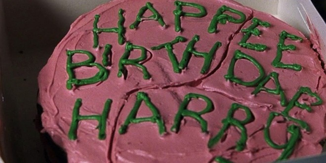
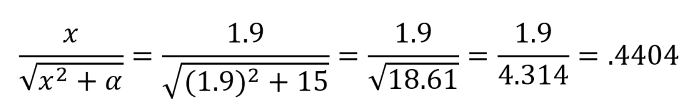
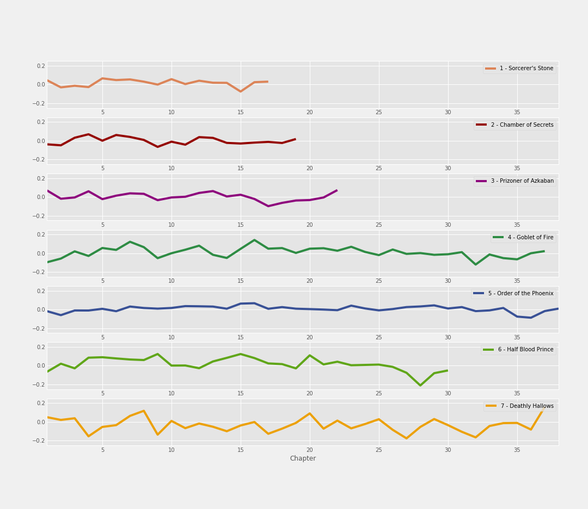
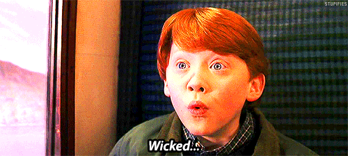
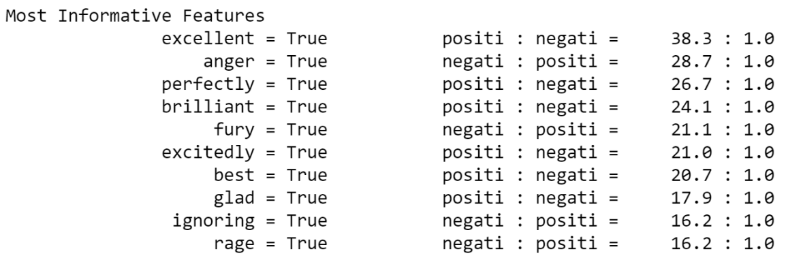
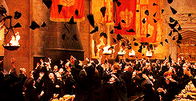

---
authors:
- admin
categories:
- Python
date: "2019-07-28T00:00:00Z"
draft: false
featured: false
image:
  caption: ""
  focal_point: ""
  placement: 2
  preview_only: true
lastmod: "2019-07-28T00:00:00Z"
projects: []
subtitle: ''
summary: Using Python, I conducted a sentiment analysis of the Harry Potter book series by chapter and book using natural language processing (NLP). I also utilized a naive bayes classifier to detect trends in sentiment throughout the books.
tags:
- Classification
- Jupyter
- Matplotlib
- Naive Bayes Classifier
- Natural Language Processing
- NLTK
- Pandas
- Python
- Text Analysis
- Text Mining
- Vader
title: 'Mood: Harry Potter'
---
This blog post is focused on Sentiment Analysis of the Harry Potter book series. Sentiment analysis extracts subjective information on a set of text - either positive sentiment, negative sentiment, or neutral sentiment. This is the last (and final) part of the Harry Potter text analysis project I've been working on, with [part one](https://erikajacobs.netlify.com/post/speaking-parseltongue-to-python/) and [part two](https://erikajacobs.netlify.com/post/harry-potter-and-the-learning-of-wordcloud/) available on my blog. Right in time for J.K. Rowling and Harry Potter's birthday!

"Happee Birthdae"! My gift is this blog and its supporting files on [GitHub](https://github.com/ErikaJacobs/Harry-Potter-Text-Mining) - you can decide for yourself whether the sentiment of this gift is positive, neutral, or negative :wink:

## Classifying Text Sentiment

From parts one and two of this project, I already had the text of each chapter from the books in my Jupyter notebook. However, the task became figuring out how assign sentiment to text in a quantitative way. After doing some research, I discovered a package in Python called VADER, which is part of the NLTK package for text processing.

How VADER works is pretty interesting! Each word with sentiment has a set of 10 independent human-rated scores between -4 (extremely negative) and 4 (extremely positive) - this score is called a valence score. All valence scores of these sentimental words are within a lexicon, which can then be used to calculate cumulative sentiment scores for sentences.

VADER uses the scores for each word to determine a positive, negative, neutral, and compound score. The positive, neutral, and negative scores fall between 0 and 1 (in which 1 signifies most sentiment), and represent a proportion of the text that falls into that category. The compound score ranges between -1 (cumulatively negative) and 1 (cumulatively positive). For example, let's look at a simple sentence:

*"The book was good."*

This sentence was scored with a positive sentiment score of .492, a neutral sentiment score of .508, and a negative sentiment score of 0.0. Cumulatively speaking, this sentence had a compound score of .4404 - a positive sentence. To get the compound score for a sentence, the formula below is used:

In this formula, x = sum of mean valence scores for all words in text. ALPHA equals a normalization parameter, valued at 15. In our example, the word "good" has a valence score of 1.9, and all other words in the sentence have a valence score of 0. The sum of 1.9 and 0 is 1.9. Therefore, x equals 1.9. From what I understand, ALPHA (or alpha) in the formula above always equals 15 in VADER. 

Do I need text for $\nabla F(\mathbf{x}_{n})$ to show inline?

Example **inline math** `$\nabla F(\mathbf{x}_{n})$` renders as $\nabla F(\mathbf{x}_{n})$.

Now that the variables going into this formula are known, *math* is done - that's how .4404 is calculated as the compound score for this sentence.

This is the basic premise behind calculating the compound score. However, there are adjustments to positive/negative/neutral valence scores of each word based on qualities such as capitalization and punctuation that complicate the calculation further than this equation. However - we don't need to go into those details for you to understand that math is being done based on the words present to figure out whether a sentence is of positive, negative, or neutral sentiment.

For the Harry Potter text, I separated out each sentence from the book series and used VADER's functionality to obtain compound sentiment scores on each sentence. Here's a graph that shows the average sentiment score per chapter for each book:

The visual above depicts average sentiment score per chapter. X axis (horizontal) represents the numerical chapter of each book, and y axis (vertical) represents compound sentiment score at that point of the book, with values above 0 having positive sentiment, and values below 0 having negative sentiment.

### Chapter with the most negative sentiment...
This graph quantifies that Dumbledore's death and the events following in "Half Blood Prince" is the chapter with the most negative sentiment in the entire book series, with an approximate compound sentiment score of -0.2. The events leading up to his death were extremely dark and detailed, which likely explains the decline in sentiment up to the point of his death, nevertheless the negativity of the events immediately afterward.

### The most neutral book...
Generally speaking, "Order of the Phoenix" was the most neutral of all the books, with the least amount of fluctuation between positive and negative. The book as a whole had an average sentiment compound score of 0.007, which is extremely close to zero. In other words, "Order of the Phoenix" is the longest and most neutral book, meaning its purpose is most likely to provide readers the most information.

### The most negative book...and the most variability in sentiment
"Deathly Hallows" has the most negative sentiment on average between all of the books, with an average compound sentiment score of -0.3 overall. This makes sense considering the amount of death and hardship experienced in the book. Furthermore, as you can likely see visually, "Deathly Hallows" had the most variability in sentiment in comparison to all other books in the series. This could likely be due to hardships and plot resolutions happening in contrast to each other, contributing to the "up and down" nature of the book overall.

### Chapter with the most positive sentiment...
The epilogue of "Deathly Hallows" featured the most positive sentiment out of all the chapters in this book series, with an approximate compound sentiment score of 0.2. With the epilogue of "Deathly Hallows" being a short chapter filled to the brim with positive words after all conflict in the books had been resolved, it makes perfect sense as to why this chapter was the most positive.

### Most negatively rated sentence...
The most negatively rated sentence in the book series is in "Deathly Hallows", when Harry goes to Godric's Hollow and fight's Voldemort's snake, Nagini. This sentence has a compound sentiment score of -.9906. The sentence in question was a lengthy sentence sentence explaining the negative circumstances Harry was in, so the length of this sentence most likely affected its compound sentiment score.

### Most positively rated sentence...
The most positively rated sentence in the book series is when the Sorting Hat is singing about the different Hogwarts houses in "Goblet of Fire." This sentence has a compound sentiment score of .9783. Like the most negatively rated sentence, this sentence was also a lengthy sentence of positive attributes related to each house, so the length of the sentence most likely affected its compound sentiment score.

### Obesrvation about ALL book conclusions...
All books have a negative "dip" toward the end followed by a positive increase in compound sentiment score, with the negative "dip" ranging from slight to drastic depending on the book. This could be related to rising action prior to the climax of each book.

Furthermore, after using VADER to detect sentiment in each sentence of the Harry Potter books, here are some additional sentiment statistics by sentence:
* There are 19,058 sentences with positive sentiment (or 25.4%)
* There are 18,384 sentences with negative sentiment (or 24.5%)
* There are 33,574 sentences with neutral sentiment (or 44.8%)

With all sentences in the Harry Potters series equipped with a compound sentiment score, this data can now be used to create a sentiment classifier!

## Sentiment Classifier

With all of our information ready to go, one big question remains.what are the fundamental differences in words between sentences with a positive and negative sentiment? Luckily, there's a mathematical way to do this with all of the sentiment scores collected.

In Python, a mathematical concept called the Naive Bayes Classifier is used to compare two groups of words, and determines which qualities are more distinct of just one group using math and probability. Once a classifier is trained and tested with an appropriate level of accuracy (70% and above, from what I've heard), an analysis can be done to see what those informative features are.

In the case of the Harry Potter text, I trained a classifier with half of the positive sentences, and half of the negative sentences. After training, the classifier had 90% accuracy. Then, I tested the other half of the positive and negative sentences, which had 80% accuracy. Success!

Let's take a look at the "Most Informative Features" from comparing the positive and negative Harry Potter text:

The numbers to the right of the "Most Informative Features" represent a ratio between positive and negative text, in which the second column explains the direction of the ratio. For example: The first row explains that the word "Excellent" is 38.3 times more likely to show up in positive text from the Harry Potter series, rather than negative text. The second row explains that the word "anger" is 28.7 times more likely to show up in negative text from the Harry Potter series, rather than positive text.

And with that.this Harry Potter text analysis project is complete!

## Closing Thoughts

Overall, this project was SO much fun to do, and was a great introduction to working with text analysis!

Now that this project is complete, I wanted to be transparent about the data I utilized for this project. In the middle of this project, I discovered that some of the text from "Chamber of Secrets" could be incorrectly ordered (or potentially missing text completely) based on the source I was using. Once I learn how to use text scraping through Python, I'm going to recreate this project and see if anything changed. I'm almost positive that the findings won't be terribly different.but I believe in honesty and transparency, which is why I'm communicating this with you. Regardless, it was still a learning experience to use the text from the source I used, and the source itself is still valuable!

Thank you for reading about this project, and I hope you continue to follow my future projects!

## Sources

This blog wouldn't have been possible without the following sources!

- [This blog](https://www.mikulskibartosz.name/how-to-split-a-list-inside-a-dataframe-cell-into-rows-in-pandas/) by Bartosz Mikulski on restacking rows
- [This blog](https://medium.com/@sharonwoo/sentiment-analysis-with-nltk-422e0f794b8) on sentiment analysis using Vader via NLTK
- [This blog](https://medium.com/analytics-vidhya/simplifying-social-media-sentiment-analysis-using-vader-in-python-f9e6ec6fc52f) on sentiment analysis using Vader via NLTK
- [This blog](https://towardsdatascience.com/sentiment-analysis-beyond-words-6ca17a6c1b54) on sentiment analysis
- [This blog](http://fjavieralba.com/basic-sentiment-analysis-with-python.html) on sentiment analysis
- [This article](https://www.datacamp.com/community/tutorials/text-analytics-beginners-nltk) from Data Camp, which I wish I found sooner
- [This website](http://datameetsmedia.com/vader-sentiment-analysis-explained/) for the VADER compound score formula
- The Vader sentiment analysis tool via the [NLTK package](https://www.nltk.org/api/nltk.sentiment.html), with citation:
     - Hutto, C.J. & Gilbert, E.E. (2014). VADER: A Parsimonious Rule-based Model for Sentiment Analysis of Social Media Text. Eighth International Conference on Weblogs and Social Media (ICWSM-14). Ann Arbor, MI, June 2014.
     - Associated lexicon found [here](https://www.kaggle.com/nltkdata/vader-lexicon)