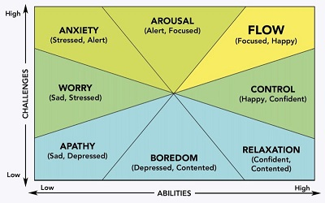

---
authors:
- admin
categories:
- Education
date: "2019-08-15T00:00:00Z"
draft: false
featured: false
image:
  caption: ""
  focal_point: ""
  placement: 2
  preview_only: true
lastmod: "2019-08-15T00:00:00Z"
projects: []
subtitle: ''
summary: With starting to teach a college level math course, what's the best way to teach concepts? How can I make it fun without losing the point? How can I help students see the importance of the skills they're learning?
tags:
- Academic
- College
- Education
- Professional
title: 'Putting the "Fun" in Functional as a Math Instructor'
---
Starting on Tuesday, I have the pleasure of teaching my first college level math class! I felt compelled to write this post to let any potential readers know that my next Python project is coming along and will be shared with you ASAP, yet I'll probably only get to finishing that post later on.

My free time the last couple of weeks has been dedicated to preparing for my class, ironing out technical issues, attending training sessions, working through busy season in my current day job, and trying to maintain a balance between my professional and personal life. All things considered.I'm doing pretty well! A former version of myself might have been running on 99.9% anxiety with this much going on.but now? I'm just excited to get started!

While this isn't my first time teaching, it's my first time with full control over how I teach the content in my classroom - Which is AWESOME! However, with this power comes great responsibility.What's the best way to teach these concepts? How can I make it fun without losing the point? How can I help students see the importance of the skills they're learning?

Over the last couple of weeks, there were a couple of seminars that touched on the idea of "flow". I was familiar with the content from some Psychology classes, yet having it placed in the context of teaching was quite fascinating. Flow is essentially a state of mind a person achieves when they are fully immersed, engaged, and focused on a challenging task that is the right balance between difficulty and skill. In the seminar, they showed a visual like this:

I really appreciate the visual above because it illustrates the consequences of not achieving that state - too easy of a task and it's boring, too difficult of a task and it's frustrating. However, I also ran into the visual below that's a little bit different.

This second visual above classifies the relationships between difficulty/challenges and skill/abilities that makes flow more of a narrow target to achieve. The first visual made the assumption that low challenge with low ability would induce flow, while this second visual did not. But why? Which one is right?

My answer? The first visual is right, in my opinion. The second visual is right if a person has high ability to complete the task. I feel like understanding this distinction is extremely important going into my classes, because there are going to be varying levels of ability coming in to learn Math. Regardless of where a student's abilities fall, the goal should be to engage them in that sweet spot of flow, rather than leaving them too bored or too frustrated. Then, once a student is able to complete tasks at an appropriate difficulty level for themselves, they'll gain more skills through the process, and therefore be able to handle more difficult tasks.

I love how learning has science behind it!

# What About Fun?

The concept of flow is functional - it's the task I'm working toward in my classroom to keep students engaged. However, just because an activity is functionally engaging doesn't mean that it's necessarily fun for students to do.

According to Google, the definition of the word fun is "amusing, entertaining, or enjoyable." Flow would certainly make a task more enjoyable versus being bored or frustrated, but flow alone isn't going to make my students excited about doing homework. So.what makes math fun?

I'm still learning the answer to this myself! However, I think application and engaging activities are key.

Have you ever been to an escape room? An escape room is when a group of people are stuck in a room for about an hour, and have to solve puzzles to get out. People who have enjoyed an escape room might not enjoy math problems, yet I'd argue that solving math problems uses the exact same skill set that someone would use in an escape room. SO many people have paid to do an escape room for fun, and I see no signs of people paying to do math problems for fun.

The difference is application. An escape room has an applicable scenario - You're given one hour to rob a bank, break out of jail, save kidnapped people, prevent a disease outbreak, escape an asylum.you get the picture. There are entertaining ways to apply those problem solving skills. THAT is what makes using those skills fun.

I can't promise to find a way to make everything in my class that entertaining right away - After all, I'm working full time while teaching this class and working on my professional portfolio. Completing this transformation will take time, yet I can promise it's on my mind and I'll be trying my best to put the "fun" in functional :smile:

