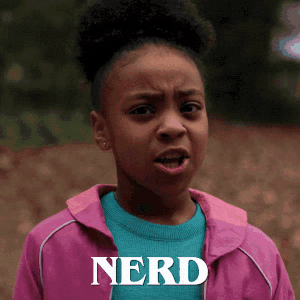
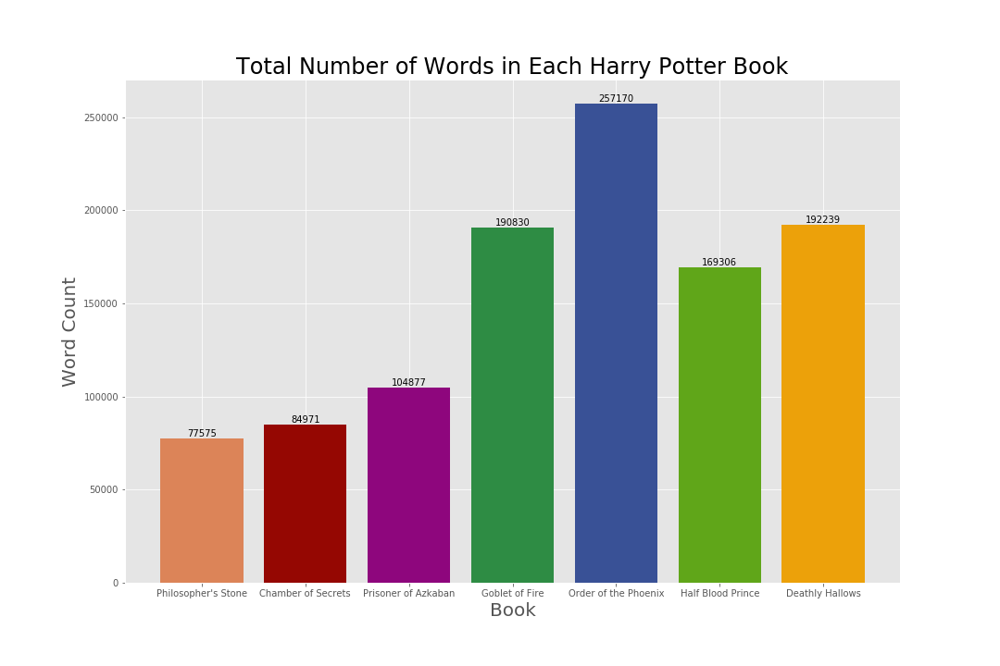
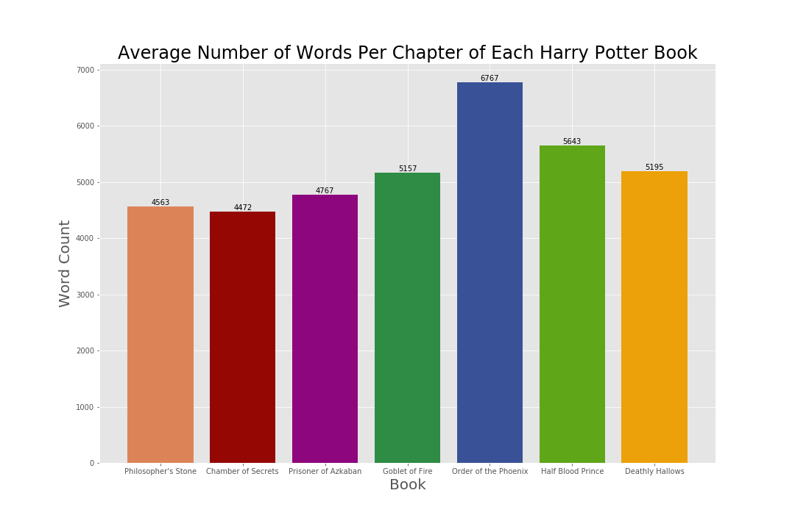
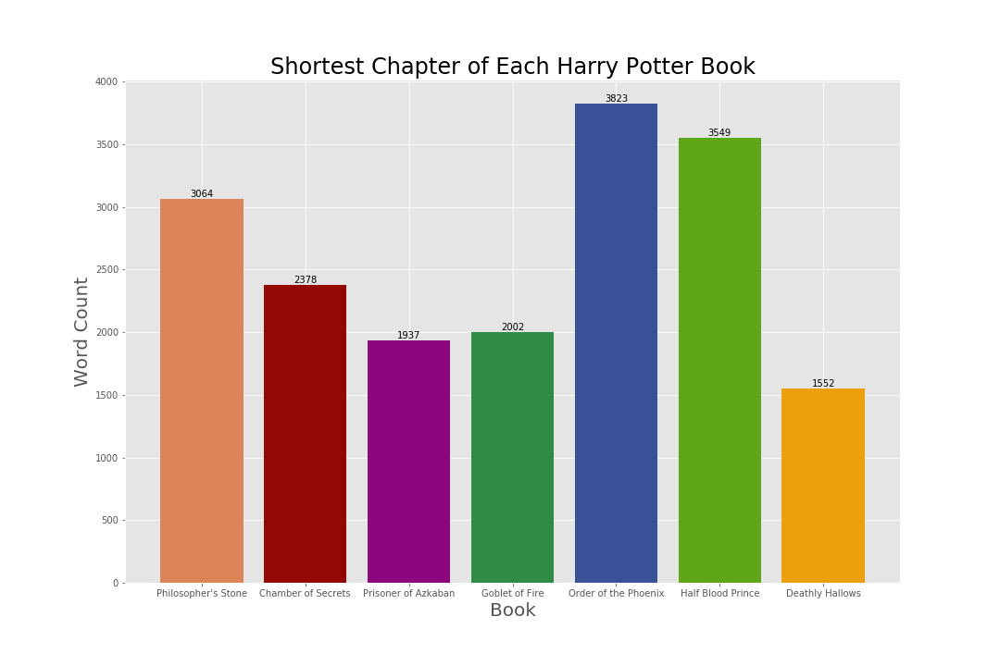
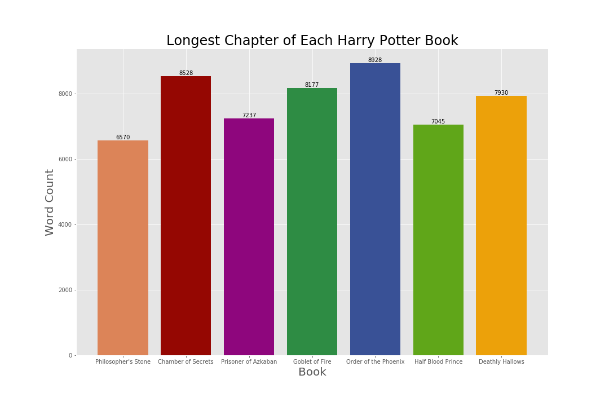

---
authors:
- admin
categories:
- Python
date: "2019-07-07T00:00:00Z"
draft: false
featured: false
image:
  caption: ""
  focal_point: ""
  placement: 2
  preview_only: true
lastmod: "2019-07-07T00:00:00Z"
projects: []
subtitle: ''
math: true
summary: I learned how to use Python by conducting exploratory data analysis on the Harry Potter book series using Natural Language Processing
tags:
- Python
- Pandas
- NLTK
- NLP
- R Studio
- Matplotlib
- Jupyter
- Text Analysis
- Text Mining
title: 'Speaking Parseltongue to Python: Adventures in Harry Potter Text Analysis'
---
The Harry Potter series is my favorite book series of all time, and is one of my favorite things to nerd out about! If you needed some proof:

1. I'm a true Hufflepuff at heart, and have been sorted that way.
2. My wand is a 13 $\frac{3}{4}$" Silver Lime wand with unicorn hair core, slightly yielding.
3. My patronus is a white mare.



Yes, it's true. So very true. I'm a nerd - and very proud of it :smile:

As one of my first projects, I thought it would fun to perform text analysis on the Harry Potter series. Text mining is a popular form of analysis being done, and is also something I've never tried before. This project is my first using Python, so I'd also like to tell you about my experience using the language so far.

Also, if you're interested in seeing my work, [click here](https://github.com/ErikaJacobs/Harry-Potter-Text-Mining) to view the GitHub repository for this project.

## Taming the "Python"

All of the data-related work in my career so far has used software outside of Python. With Python being one of the more popular and versatile programming languages to learn for data science, I've decided that my entire portfolio will mostly be focused on implementing analysis through Python. This seemed like a wise way to go so I can learn how to use it, as well as show all of you that I can use it. Everything you see going forward was done in Python via Jupyter without any prior experience!

For learning Python, I'd recommend the [Python for Data Science](https://www.edx.org/course/python-for-data-science-2?source=aw&awc=6798_1586986927_f0f9233d7901679c25317a04d3fe3309&utm_source=aw&utm_medium=affiliate_partner&utm_content=text-link&utm_term=78888_Skimlinks) course through edX, which is provided by UC San Diego. What's really nice about this course is they provide Jupyter notebooks of projects with sample code to learn from, which has been most helpful from an experiential standpoint. It's also free! [Automate The Boring Stuff With Python](https://automatetheboringstuff.com/) by Al Sweigart was a good general starting point to Python as a whole, and the [Python for Data Science Handbook](https://jakevdp.github.io/PythonDataScienceHandbook/) by Jake VanderPlas seems like a good read once I'm more familiar with Python as a whole.

Python has been a pretty intuitive language to learn. However, doing what you want to do in Python sometimes takes multiple tries. I'm not as efficient as Harry Potter speaking parseltongue to a snake in "Chamber of Secrets", if you know what I mean.


Regardless, I've made some progress! Even though I was expecting to show you more this week, I've spoken parseltongue to Python the best way I know how.which is with a ton of help from Google to translate :wink:

## First Impressions Working With Text

One of the biggest ways I underestimated this project was the learning curve behind working with text, as well as with Python in general. Getting to a place where you can actually DO text mining and analysis can be rough stuff! Finding a source to use can be daunting, issues with text encoding can pop up left and right, and importing said text in a usable way can supply a ton of bumps in the road. Luckily, using Google to look up errors has been a godsend - there's almost always someone on a Stack forum who's experienced a similar issue.

I was hoping to have a complete analysis for you today, but I have spent most of my time this week learning how to work with text in Python. As a result, I'm splitting this project into a couple of blog entries. For today, I'll be focusing on word counts and averages.

## Getting The Data

As I was looking through the internet for a reliable and legal source of Harry Potter text from the books, I was lucky enough to stumble upon an [R Package](https://github.com/bradleyboehmke/harrypotter) that had the text for all seven books ready to use. Huge thanks to [Bradley Boehmke](http://bradleyboehmke.github.io/) for creating this :smile:

His website had directions for how to install his package, yet I personally ran into installation issues. If you're inspired by my blog and want to try this package, here's the code I ran in R Studio to install it:

```{r}
install.packages(c("curl", "httr", "devtools"))
devtools::install_github("bradleyboehmke/harrypotter")
```

Once the package was installed and loaded, I was able to export the text files and import them to Python.

## Exploratory Data Analysis - Word Count

To start with exploring Harry Potter's text data, I created some bar charts on word count data points to get familiar with the text. Here's some of what I created!



### Total Number of Words in Each Harry Potter Book: 
The bar chart above shows that the trend of total word count between each Harry Potter book got higher with each release until "Half Blood Prince", in which the word count dropped. Despite this drop, all books released after "Prizoner of Azkaban" exceeded the average word count of a book in the Harry Potter series, which is approximately 153,853 words.



### Average Number of Words Per Chapter of Each Harry Potter Book: 
An average chapter of text from the Harry Potter series in total is approximately 5,385 words, in which 5 of the 7 books have an average chapter length below this average, and 6 of the 7 books within 300 words of this average. "Order of the Phoenix" has a larger word count per chapter compared to the other books in the series, and also has the most chapters of all seven books (with 38 chapters). It appears that the average chapter of text could be skewed due to "Order of the Phoenix" and its long/numerous chapters.



### Shortest Chapter of Each Harry Potter Book: 
"Deathly Hallows" features the shortest chapter of the entire book series, which was Chapter 37 (or the Epilogue) with 1,552 words. It makes sense that this would be the shortest chapter, considering the conflict of the book series had already been resolved in Chapter 36. The shortest chapter in "Order of the Phoenix" is still pretty long.



### Longest Chapter of Each Harry Potter Book: 
Surprise, surprise! "Order of the Phoenix" takes the prize for having the longest chapter in the entire book series with 8,928 words. Chapter 13, titled "Detention With Dolores," gives readers a taste of Dolores Umbridge and her unorthodox ways of punishing students during detention - and apparently, every detail counts.

## Final Thoughts
There is still MUCH more to come in this analysis. Coming up next will be counts of distinct words per book, word clouds, keyword analysis (characters and spells), and sentiment analysis. Stay tuned!